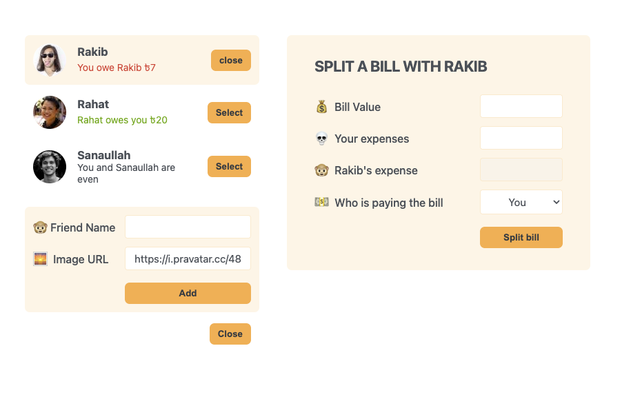

# 🍽️ Eat-n-Split



## 📝 Description

A React-based bill splitting application that helps friends track shared expenses and manage who owes whom. Simple, intuitive interface for adding friends and splitting restaurant bills fairly.

## ⚡ How It Works

1. **Add Friends** - Create a list of friends with their profile pictures
2. **Select Friend** - Choose who you want to split a bill with
3. **Enter Bill Details** - Input total amount and how much you paid
4. **Split Automatically** - App calculates who owes what and updates balances
5. **Track Debts** - See at a glance who owes money to whom

## ⚛️ React Concepts Learned

• **useState Hook** - Managing component state (friends list, selected friend, form inputs)
• **Component Composition** - Breaking UI into reusable components (Button, Friend, FriendList)
• **Props & Props Drilling** - Passing data down through component hierarchy
• **Conditional Rendering** - Showing/hiding components based on state (`&&` operator)
• **Event Handling** - onClick, onChange, onSubmit events
• **Controlled Components** - Form inputs controlled by React state
• **State Lifting** - Moving state up to share between components
• **Array Methods with State** - Using map() to render lists and update specific items
• **Functional Updates** - Using setState with functions for complex state updates
• **Optional Chaining** - Safe property access with `?.` operator

## 📁 Project Structure

```
eat-n-split/
├── public/
│   ├── favicon.ico
│   ├── index.html
│   └── manifest.json
├── src/
│   ├── components/
│   │   └── App.js
│   ├── index.css
│   └── index.js
├── package.json
└── README.md
```

## 🚀 Local Installation

1. **Clone the repository**
   ```bash
   git clone https://github.com/ashifulalam/eat-n-split.git
   ```

2. **Navigate to project directory**
   ```bash
   cd eat-n-split
   ```

3. **Install dependencies**
   ```bash
   npm install
   ```

4. **Start development server**
   ```bash
   npm start
   ```

5. **Open in browser**
   ```
   http://localhost:3000
   ```


